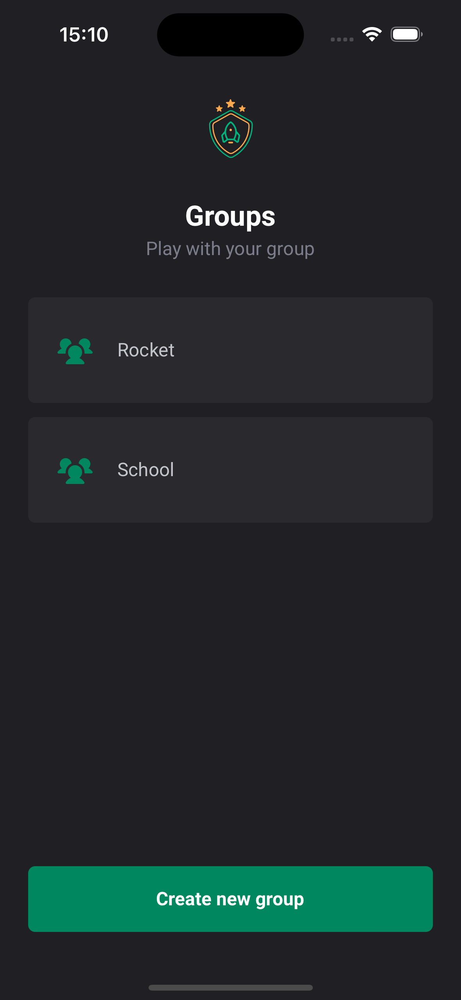
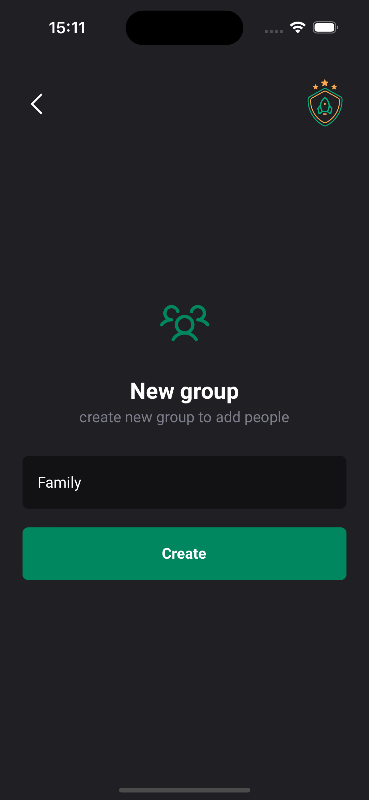
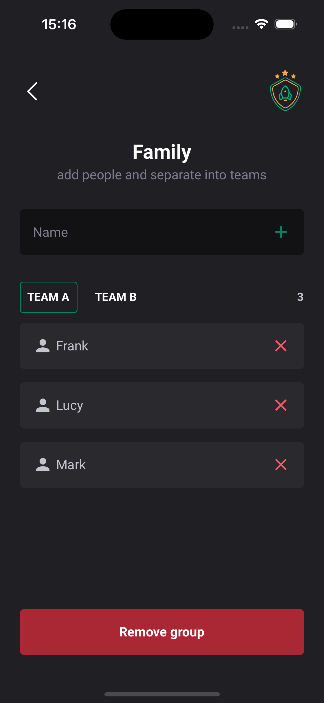

# Ignite Teams
## The App
This is a app that allows you to create groups and divide them into teams so you can play games with your friends.

### Previews

  
  
  

### Techs
1. React Native
2. React
3. Expo Go
4. Typescript
5. Styled Components
6. Stack Navigator

### Steps
1. Clone this repository;
2. Run your preferred command to install dependencies:
- `npm install`
3. Run the app with:
- `npx expo start`
4. If your using a simulator:
- IOS: `npm run ios`
- Android: `npm run android`